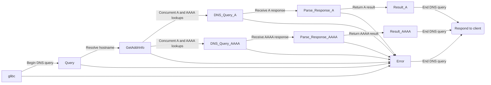

# DNS
DNS stands for Domain Name System. It is a system used to translate human-readable domain names, such as www.example.com, into IP addresses that are used by computers to communicate with each other over the internet. DNS is a critical component of the internet infrastructure and plays a crucial role in ensuring that users can access the websites and online services they need.

# DNS Records
DNS records are pieces of information stored in a domain name system (DNS) server that help to identify and manage various aspects of a domain, such as its web servers, email servers, and other services associated with it. These records provide information about the IP address of the server associated with the domain, the mail server responsible for handling email, and other settings that are necessary for accessing the domain.

There are different types of DNS records, each with a specific function. Some common types of DNS records include:
- A (Address) record: This response type maps a domain name to an IP address.
- AAAA (IPv6 Address) record: This response type maps a domain name to an IPv6 address.
- CNAME (Canonical Name) record: This response type provides an alias for a domain name, allowing multiple domain names to point to the same IP address.
- MX (Mail Exchange) record: This response type specifies the mail server responsible for handling email for a domain.
- NS (Name Server) record: This response type specifies the authoritative name servers for a domain.
- PTR (Pointer) record: This response type maps an IP address to a domain name.
- SOA (Start of Authority) record: This response type provides information about the DNS zone, including the primary name server for the zone and the email address of the zone administrator.
- TXT (Text) record: This response type allows arbitrary text to be associated with a domain name.

DNS records are essential for the proper functioning of the internet and are used by web browsers, email servers, and other network services to locate the servers responsible for hosting a particular domain or service.

# DNS Responses
DNS (Domain Name System) responses are the answers provided by a DNS server when a DNS query/lookup is made. When a user types in a domain name in their browser, the browser sends a DNS query to a DNS server to resolve the domain name into an IP address.

A DNS response contains information about the requested domain name, such as its IP address, hostname, and other DNS records associated with the domain name. The response can also include information about other DNS servers that can be used to resolve the domain name if the initial server does not have the requested information.

# What does a DNS lookup do?


# What does a DNS lookup look like in a packet capture?
A packet capture for a DNS lookup typically contains several packets exchanged between the DNS client and server. Here is an example of what a packet capture might look like using Wireshark:
```
No.     Time           Source                Destination           Protocol  Length   Info
1       0.000000000    192.168.0.10          8.8.8.8               DNS       68       Standard query 0xf040 A example.com

2       0.001234567    8.8.8.8               192.168.0.10          DNS       114      Standard query response 0xf040 A example.com A 93.184.216.34
```
In this example, the DNS client at IP address 192.168.0.10 is performing a DNS lookup for the domain name "example.com" by sending a DNS query packet to the Google Public DNS server at IP address 8.8.8.8. The DNS query packet contains the following information:

- Query ID: 0xf040
- Query Type: A (IPv4 address)
- Query Name: example.com

The DNS server responds with a DNS response packet that contains the following information:
- Query ID: 0xf040
- Response Type: Standard Query Response
- Response Code: No Error
- Answer Section: One resource record for "example.com" containing an IPv4 address (93.184.216.34)

This packet capture demonstrates the basic exchange between a DNS client and server during a DNS lookup. The client sends a query packet requesting information about a specific domain name, and the server responds with a response packet containing the requested information (in this case, an IPv4 address).

# Top Level Domain
A top-level domain (TLD) is the last segment of a domain name in the hierarchical Domain Name System (DNS) of the internet. It is the part of the domain name that follows the last dot, such as ".com", ".org", ".net", and so on.

There are two main types of TLDs: generic top-level domains (gTLDs) and country-code top-level domains (ccTLDs).

Generic top-level domains (gTLDs) are used globally and include TLDs such as ".com", ".org", ".net", and ".edu". These TLDs are typically used for commercial, non-profit, network infrastructure, and educational purposes, respectively.

Country-code top-level domains (ccTLDs) are two-letter domain extensions reserved for countries and territories. Examples include ".us" for the United States, ".uk" for the United Kingdom, ".ca" for Canada, and so on.

ICANN (Internet Corporation for Assigned Names and Numbers) manages the assignment of TLDs, including the creation of new gTLDs. The TLDs play an important role in identifying and differentiating websites and online services on the internet.

# Root DNS Servers
A root DNS server is a DNS server that is responsible for answering requests to resolve top-level domains (TLDs) on the internet. The root DNS servers contain the master list of all TLDs, including both generic top-level domains (gTLDs) and country-code top-level domains (ccTLDs).

There are 13 root DNS servers in the world, each identified by a letter from A to M. These root DNS servers are distributed geographically and maintained by various organizations around the world. Each root DNS server has multiple copies, or instances, that are distributed globally to improve reliability and reduce network latency.

When a user types a domain name into their browser, their DNS resolver initiates a series of DNS queries to resolve the domain name to an IP address. If the DNS resolver does not already have the IP address in its cache, it sends a query to one of the root DNS servers to determine the authoritative DNS server for the TLD associated with the domain name. The root DNS server responds with the IP address of the authoritative DNS server for the TLD, and the DNS resolver can then query the authoritative DNS server for the specific domain name to obtain its IP address.

# Authoritative DNS Servers
An authoritative DNS server is a DNS server that is responsible for providing the official DNS information, or DNS records, for a particular domain name. When a DNS resolver receives a query for a domain name, it first contacts the authoritative DNS server for that domain to obtain the most up-to-date and accurate DNS information.

Authoritative DNS servers are responsible for storing and serving DNS records that define the mapping between domain names and IP addresses, as well as other DNS information such as mail server (MX) records, name server (NS) records, and text (TXT) records.

There are two types of authoritative DNS servers: primary authoritative DNS servers and secondary authoritative DNS servers. The primary authoritative DNS server is the master copy of the DNS records for a particular domain name, while secondary authoritative DNS servers are copies of the primary authoritative DNS server that are used to improve the reliability and performance of the DNS resolution process.

# Difference between authoritative and non-authoritative answers
The main difference between an authoritative and non-authoritative DNS response is the source of the DNS information provided in the response.

An authoritative DNS response is provided by a DNS server that is considered to be the ultimate source of the DNS information for a particular domain name. This means that the DNS server providing the response is responsible for hosting and managing the DNS records for that domain name. Authoritative DNS responses are considered to be the most reliable and accurate source of DNS information for a domain name.

On the other hand, a non-authoritative DNS response is provided by a DNS server that does not host the DNS records for the domain name being queried. Instead, the non-authoritative DNS server has obtained the DNS information from another DNS server, typically by forwarding the query to an authoritative DNS server and caching the response. Non-authoritative DNS responses may be less reliable and accurate than authoritative DNS responses, as they may be subject to caching and other factors that can affect their validity over time.

# Fully Quantified Domain Names (FQDN)
A fully qualified domain name (FQDN) is a domain name that specifies the exact location of a host in the Domain Name System (DNS) hierarchy. An FQDN consists of a host name and a domain name separated by a period (.). For example, "www.example.com" is a fully qualified domain name, where "www" is the host name and "example.com" is the domain name.

An FQDN includes all of the labels and subdomains that identify a host's location in the DNS hierarchy, from the top-level domain (TLD) to the specific host name. A domain name is considered fully qualified if it contains the TLD, the domain name, and the host name.

Fully qualified domain names are used to uniquely identify hosts and resources on the internet and are essential for performing DNS lookups and resolving domain names to IP addresses. In contrast, a partially qualified domain name (PQDN) or non-fully qualified domain name (NFQDN) does not include all the labels and subdomains needed to specify the exact location of a host in the DNS hierarchy. The DNS resolver may need to append the default domain name or search domains to the PQDN or NFQDN to resolve the domain name to an IP address.

# resolv.conf
resolv.conf is a configuration file used by the Domain Name System (DNS) resolver in Unix-like operating systems. The file contains the configuration information for the DNS client resolver, including the IP addresses of DNS servers that the resolver should use to resolve domain names to IP addresses.

The file consists of several lines of configuration options, each beginning with a keyword followed by a value. Some of the common configuration options in resolv.conf include:

- nameserver: Specifies the IP address of a DNS server that the resolver should use to resolve domain names.
- domain: Specifies the default domain name that should be appended to unqualified domain names.
- search: Specifies a list of domain names that should be searched in order when resolving unqualified domain names.
- options: Specifies additional options for the DNS resolver, such as the maximum number of retries and the timeout interval for DNS queries.

The resolv.conf file is an important configuration file for the DNS resolver and can have a significant impact on the performance and reliability of DNS resolution on a system.

# ndots

"ndots" is a configuration option in the resolv.conf file that specifies the minimum number of dots (.) that must be present in a domain name before the DNS resolver considers it to be a fully qualified domain name. The option is used to control the resolver's behavior when resolving domain names that are not fully qualified.

For example, if the ndots option is set to 2, the DNS resolver will consider a domain name with at least two dots to be fully qualified (e.g., "example.com"), but will not consider a domain name with only one dot to be fully qualified (e.g., "com"). If the DNS resolver receives a query for a non-fully qualified domain name and ndots is set to a value greater than or equal to the number of dots in the domain name, the resolver will attempt to resolve the domain name by appending the default domain name or by searching through the domains listed in the "search" option of the resolv.conf file.

The ndots option can be used to prevent the DNS resolver from performing unnecessary domain searches and lookups for non-fully qualified domain names. By setting ndots to a value appropriate for the organization's domain naming conventions, the DNS resolver can more efficiently and accurately resolve domain names to IP addresses.

# glibc vs musl-libc
Both glibc and musl-libc are C libraries used in Linux-based operating systems. The main difference between them when it comes to DNS lookup is the implementation of the DNS resolver.

In glibc, the DNS resolver is implemented using a daemon called "nscd" (Name Service Caching Daemon). When a DNS lookup is requested, the nscd daemon first checks its cache for the result. If the result is not found in the cache, it queries the DNS server specified in the /etc/resolv.conf file. The result is then cached for future use.

In musl-libc, on the other hand, the DNS resolver is implemented as a static library linked into the application. When a DNS lookup is requested, the library queries the DNS server specified in the /etc/resolv.conf file directly, without using a caching daemon. This means that musl clients do not have a caching mechanism, and each DNS lookup results in a separate query to the DNS server.

Overall, the main difference between glibc and musl when it comes to DNS lookup is the caching mechanism. Glibc clients use a caching daemon to speed up subsequent DNS lookups, while musl clients do not cache results and query the DNS server directly each time.

# Example glibc client

In the example above, we are entering a domain into a webbrowser on a glibc based client:
1. A user opens a web browser and enters a domain name in the address bar.
2. The web browser sends a library call to the glibc library to resolve the domain name.
3. The glibc library checks the nsswitch.conf file to determine the order in which different name services are queried.
4. The glibc library sends a DNS request to the nscd daemon.
5. If the result is found in the nscd cache, it is returned to the glibc library, which in turn returns it to the web browser.
6. If the result is not found in the nscd cache, the nscd daemon sends a DNS request to the DNS server specified in the /etc/resolv.conf file.
7. The DNS server responds with the IP address associated with the domain name.
8. The result is cached by the nscd daemon for future use.
9. The result is returned to the glibc library, which in turn returns it to the web browser.

# Example musl-libc client

In the example above, we are entering a domain into a webbrowser on a musl based client:
1. A user opens a web browser and enters a domain name in the address bar.
2. The web browser sends a library call to the musl library to resolve the domain name.
3. The musl library reads the /etc/resolv.conf file to determine the DNS server to query.
4. The musl library sends a DNS request directly to the DNS server specified in the /etc/resolv.conf file.
5. The DNS server responds with the IP address associated with the domain name.
6. The result is returned to the musl library, which in turn returns it to the web browser.

# Known musl-libc issues

"musl-libc provides no facility for TCP based requests and responses. In the case of certain resolvers, such as AWS’ EC2 local segment DNS, responses longer than a single 512 byte UDP packet - DNS’ archaic standard - get flagged as truncated, and may not contain a single A record."

[Source](https://www.linkedin.com/pulse/musl-libc-alpines-greatest-weakness-rogan-lynch/)

This limitation of musl-libc is discussed in depth upstream and there has been work from the musl-libc maintainer to support TCP based requests. That code can be found [here](https://git.musl-libc.org/cgit/musl/commit/?id=51d4669fb97782f6a66606da852b5afd49a08001) and should be implemented in musl-libc `1.2.4`.

# I have disabled IPv6, why do I still see AAAA queries?

glibc DNS lookups use the GetAddrInfo function to perform DNS resolution. GetAddrInfo is a function provided by the glibc library that maps a hostname and a service name to a set of socket addresses. The function can handle various network protocols such as IPv4 and IPv6, and it supports both numeric and symbolic host and service names.

When an application running on a system that uses glibc makes a DNS query, it typically calls a higher-level function such as gethostbyname or getaddrinfo. These functions then call GetAddrInfo to perform the actual DNS resolution.

GetAddrInfo takes a hostname and a service name as input and returns an array of sockaddr structures, each containing an IP address and a port number. The function can perform both IPv4 and IPv6 lookups, and it can also perform reverse DNS lookups to obtain hostnames from IP addresses.

When GetAddrInfo is called, it first checks if the requested hostname has already been resolved and cached in memory. If the hostname is not cached, GetAddrInfo sends a DNS query to the DNS resolver specified in the system's network configuration. The function queries both the A and AAAA records of the hostname to obtain IPv4 and IPv6 addresses, respectively. The queries are made concurrently, so the function can obtain both A and AAAA records in parallel. There are no plans to allow disabling the concurrent A/AAAA lookups in GetAddrInfo in future releases. 

Once the DNS resolver responds with the IP addresses, GetAddrInfo parses the response and stores the resolved addresses in memory for future use. It then returns the array of sockaddr structures containing the IP addresses and port numbers to the calling function.
